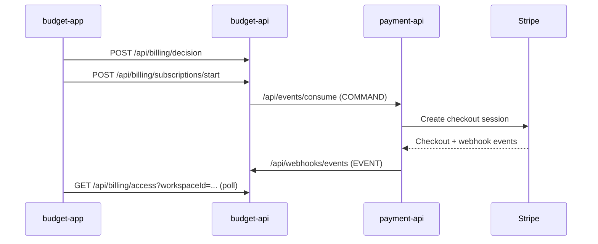

# Budget App Integration Flows

## 1. Authentication And Session Flow
1. User submits credentials to `auth` (`/api/auth/signin`).
2. Frontend stores only access token in client state.
3. Refresh token is managed as HttpOnly cookie by `auth` service.
3. Interceptor appends bearer token to backend calls.
4. On `401`, frontend attempts refresh using `/api/auth/refresh` with credentials.
5. On app startup without access token, frontend attempts session restore using `/api/auth/session/bootstrap`.

## 2. Signup Flow
1. Frontend calls `POST /api/auth/signup`.
2. User is redirected to login flow and authenticates.
3. `OnboardingOrchestrator` resolves post-auth path (`create-workspace`, `select-workspace`, or target route).

## 2.1 Reactivation Flow (Canceled Account)
1. Frontend calls `POST /api/auth/signup`.
2. If `auth` returns canceled-account conflict, frontend calls explicit `POST /api/auth/reactivate`.
3. Reactivation preserves account identity/data and requires email verification again.
4. User returns to login and continues normal onboarding orchestration.

## 3. Onboarding Orchestration Flow
1. Login/OAuth callback calls `OnboardingOrchestrator.resolvePostAuthRoute(...)`.
2. Orchestrator normalizes `redirect` and optional `plan` into a canonical target path.
3. If user has no workspace: route to `create-workspace`.
4. If tenant context is required but not selected: route to `select-workspace`.
5. If a single/preferred workspace is available: attempt automatic workspace selection.
6. Route user to final target (`/dashboard`, `/choose-plan?plan=...`, `/checkout?plan=...`).

## 4. Workspace Creation And Tenant Selection
1. Frontend calls `POST /api/workspaces` on `budget-api`.
2. Frontend updates active workspace in local state (`userStore.selectWorkspace(...)`).
3. Axios interceptor sends `X-Workspace-Id` for workspace-scoped calls.
4. Backend validates membership and role dynamically for each request.
5. Frontend resumes the canonical redirect target from onboarding context.

## 5. Onboarding Status Banner Flow
1. `App.vue` renders `OnboardingStatusBanner` for authenticated sessions.
2. Banner computes state via `OnboardingOrchestrator.resolveOnboardingBannerState(...)`.
3. Banner exposes contextual CTA to unblock the next onboarding step.
4. CTA routes to `create-workspace`, `select-workspace`, or `choose-plan` using canonical redirect.

## 6. Billing Upgrade Flow (Current Path)
1. Frontend calls `/api/billing/decision` in `budget-api` with user intent plus allowed workspace context.
2. Backend resolves the canonical billing account internally; frontend does not know ownership.
3. If action is `START_SUBSCRIPTION`, frontend calls `/api/billing/subscriptions/start`.
4. Frontend polls `/api/billing/operations/{messageId}` for `redirectUrl`.
5. After Stripe return, frontend polls `/api/billing/access?workspaceId=...` for the canonical billing summary and premium activation.

## 7. Deprecated Flow (Do Not Use)
- Direct frontend calls to `payment-api /api/subscription/*` are legacy compatibility only.
- New implementation must always go through `budget-api` billing decision/orchestration endpoints.
