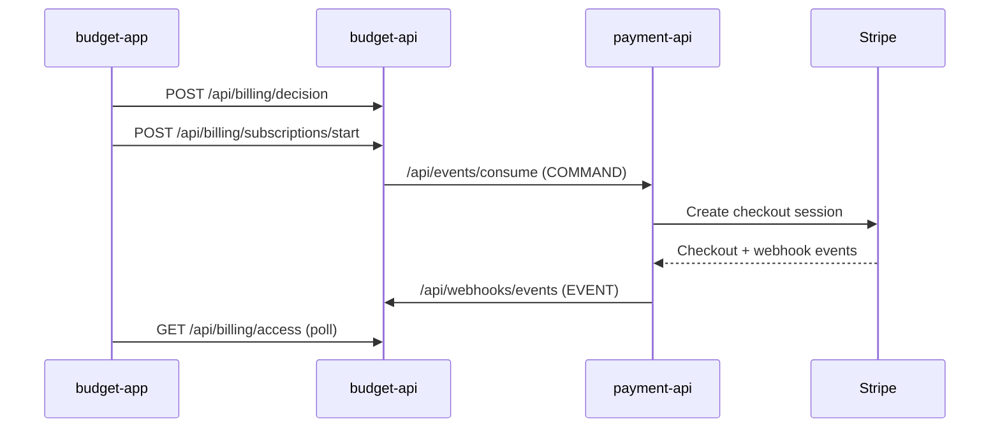

# Budget App Integration Flows

## 1. Authentication And Session Flow
1. User submits credentials to `auth` (`/api/auth/signin`).
2. Tokens are stored in client state.
3. Interceptor appends bearer token to backend calls.
4. On `401`, frontend attempts refresh using `/api/auth/refresh`.

## 2. Signup Flow
1. Frontend calls `POST /api/auth/signup`.
2. User receives session credentials.
3. Backend-side outbox sync propagates user-created events to core domain.

## 3. Workspace Creation And Tenant Selection
1. Frontend calls `POST /api/companies` on `budget-api`.
2. User selects active company via `POST /api/auth/select-company`.
3. New tenant-scoped token is issued and used for workspace-scoped calls.

## 4. Billing Upgrade Flow (Current Path)
1. Frontend calls `/api/billing/decision` in `budget-api`.
2. If action is `START_SUBSCRIPTION`, frontend calls `/api/billing/subscriptions/start`.
3. Frontend polls `/api/billing/operations/{messageId}` for checkout URL.
4. After Stripe return, frontend polls `/api/billing/access` for premium activation.

## 5. Deprecated Flow (Do Not Use)
- Direct frontend calls to `payment-api /api/subscription/*` are legacy compatibility only.
- New implementation must always go through `budget-api` billing decision/orchestration endpoints.
